# 히어링루프 Wi-Fi 통신 확인 절차

히어링루프에 설치된 **Wi-Fi가 정상 동작하는지 원격으로 확인**하기 위한 절차입니다.

기기를 한 번 등록해 두면 현장에 가지 않아도 웹에서 전원·동작·Wi-Fi 신호·과열 상태를 실시간으로 확인할 수 있고,
**펌웨어도 원격으로 업데이트(OTA)** 할 수 있습니다.

**대상 펌웨어** ESP32 `3.1.0` · nRF `1.5.0` (세트 `v260071300`) · **소요 시간** 기기 1대당 15~20분

---

## 목차

- [접속 정보](#접속-정보)
- [시작하기 전에](#시작하기-전에)
- [1단계 펌웨어 업데이트](#1단계-펌웨어-업데이트)
- [2단계 서버 환경 설정](#2단계-서버-환경-설정)
- [3단계 모니터링 등록](#3단계-모니터링-등록)
- [4단계 원격 펌웨어 업데이트](#4단계-원격-펌웨어-업데이트)
- [자주 묻는 질문](#자주-묻는-질문)

---

## 접속 정보

| 항목 | 값 |
| --- | --- |
| 모니터링 페이지 (시험용) | <https://staging.smarthearingloop.com> |
| 아이디 | `admin` |
| 비밀번호 | `admin1234` |

> [!NOTE]
> 시험용 서버입니다. 운영 서버(`smarthearingloop.com`)와 화면은 같고 데이터만 분리되어 있어,
> 여기에 시험 시료를 등록해도 실제 운영 기기 목록에는 영향을 주지 않습니다.

### 준비물

- 히어링루프 본체 (전원 인가된 상태)
- 휴대폰 또는 PC (Wi-Fi 연결 가능)
- 연결할 공유기의 SSID와 비밀번호
- 펌웨어 파일 `HearingLoop_Firmware_v260071300.zip`
- 하드웨어 설정 가이드 `HearingLoop_Smart_Guide.pdf`

### 전체 흐름

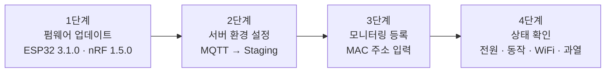
```mermaid
flowchart LR
    A["1단계<br/>펌웨어 업데이트<br/>ESP32 3.1.0 · nRF 1.5.0"]
    B["2단계<br/>서버 환경 설정<br/>MQTT → Staging"]
    C["3단계<br/>모니터링 등록<br/>MAC 주소 입력"]
    D["4단계<br/>상태 확인<br/>전원 · 동작 · WiFi · 과열"]
    A --> B --> C --> D
```

---

## 시작하기 전에

### Wi-Fi 연결이 가장 먼저입니다

휴대폰으로 히어링루프에 직접 접속해 **기기를 공유기에 연결시키는 것이 1순위**입니다.

Wi-Fi가 연결되지 않으면 이후 작업이 하나도 진행되지 않습니다.
펌웨어 업데이트도, 서버 환경 설정도, 모니터링 등록도 모두 기기가 인터넷에 붙어 있어야 가능합니다.

→ [1.1 기기 Wi-Fi에 접속](#11-기기-wi-fi에-접속) 부터 시작하세요.

### 기기는 MAC 주소로 식별합니다

등록·조회 모두 **MAC 주소**를 기준으로 합니다.
설치 장소나 공유기가 바뀌어 IP가 달라져도 다시 등록할 필요가 없습니다.

### ESP32 Version이 3.1.0이어야 합니다

> [!IMPORTANT]
> 설정 화면의 `ESP32 Version` 이 **3.1.0이 아니라면, 먼저 3.1.0으로 업데이트한 뒤 진행하세요.**
> 그 이전 버전에서는 MAC을 등록해도 모니터링 목록에 나타나지 않습니다.

아래와 같은 화면이 보이고 `ESP32 Version` 이 2.x 라면, 휴대폰으로 히어링루프에 직접 접속해
이 페이지에서 펌웨어 파일을 올려 **3.1.0으로 업데이트**해야 합니다.
절차는 [1단계](#1단계-펌웨어-업데이트)를 참고하세요.

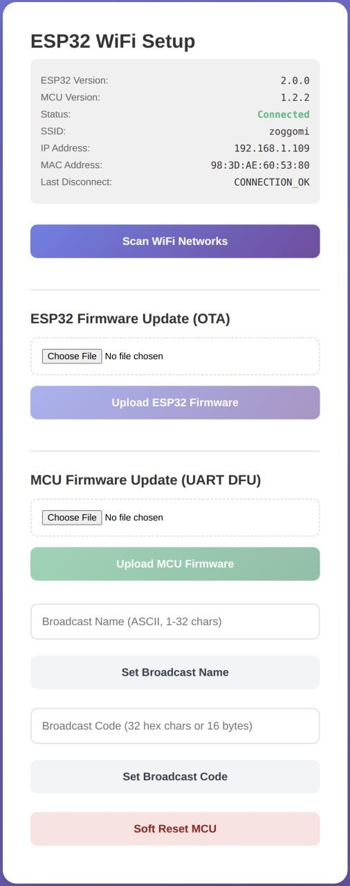

---

## 1단계 펌웨어 업데이트

> [!TIP]
> 이 단계는 하드웨어 설정 가이드(`HearingLoop_Smart_Guide.pdf`)와 같은 내용입니다. 여기서는 요약만 싣습니다.

### 1.1 기기 Wi-Fi에 접속

1. 히어링루프 전원을 켭니다.
2. 휴대폰 Wi-Fi 목록에서 **`ky_hearing_loop`** 를 선택합니다.
3. 비밀번호 **`kyhearingloop`** 를 입력해 연결합니다.
4. 연결된 Wi-Fi의 ⓘ(상세)를 눌러 **라우터 주소가 `192.168.4.1`** 인지 확인합니다.

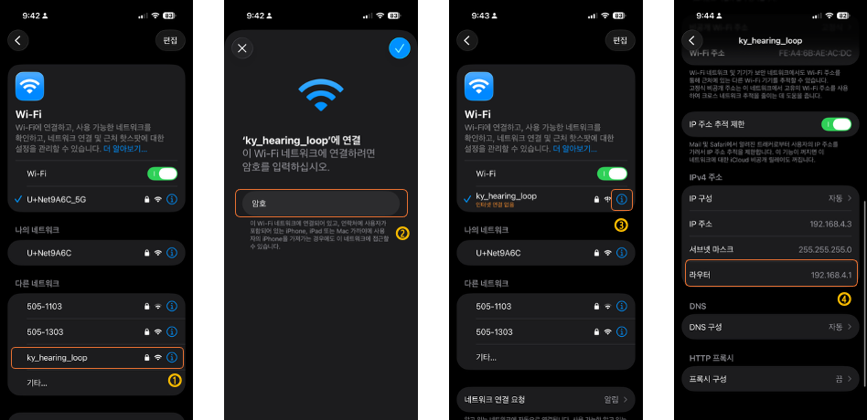

### 1.2 설정 페이지 열기

브라우저 주소창에 **`192.168.4.1`** 을 입력하면 `ESP32 WiFi Setup` 페이지가 열립니다.

### 1.3 공유기에 연결

1. **`Scan WiFi Networks`** 를 누릅니다.
2. 목록에서 연결할 공유기를 선택합니다.
3. 공유기 비밀번호를 입력하고 **`Connect`** 를 누릅니다.
4. 화면 상단 **`IP Address`** 에 공유기가 부여한 주소(예: `192.168.219.109`)가 표시되면 성공입니다.

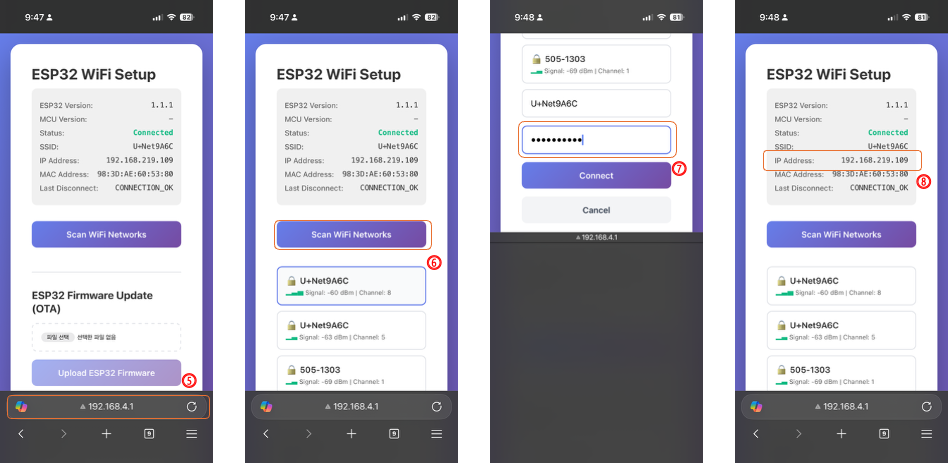

연결에 실패하면 1.2 ~ 1.3을 다시 시도하세요.
이후에는 `192.168.4.1` 대신 이 새 IP로도 같은 설정 페이지에 접속할 수 있습니다.

### 1.4 ESP32(Wi-Fi) 펌웨어 업데이트

1. `HearingLoop_Firmware_v260071300.zip` 의 압축을 풉니다.
2. **`ESP32 Firmware Update (OTA)`** 영역에서 `Choose File` → **`hearing_loop_esp_v3.1.0.bin`** 선택
3. **`Upload ESP32 Firmware`** 를 누릅니다.
4. `Update complete! Device will reboot...` 이 뜨면 완료입니다. 잠시 후 자동 재부팅됩니다.
5. 브라우저를 새로고침해 **`ESP32 Version: 3.1.0`** 인지 확인합니다.

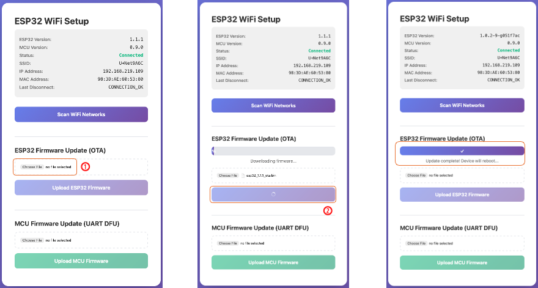

### 1.5 nRF(MCU) 펌웨어 업데이트

1. **`MCU Firmware Update (UART DFU)`** 영역에서 `Choose File` → **`hearing_loop_nrf_v1.5.0.bin`** 선택
2. **`Upload MCU Firmware`** 를 누릅니다.
3. `MCU firmware updated successfully!` 가 뜨면 완료입니다.
4. 브라우저를 새로고침해 **`MCU Version: 1.5.0`** 인지 확인합니다.

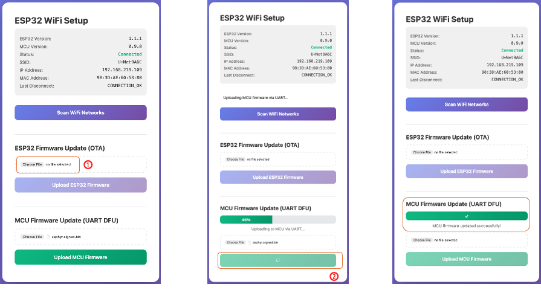

> [!WARNING]
> ESP32와 nRF는 파일이 다릅니다. 서로 바꿔 올리지 않도록 주의하세요.

### 1.6 버전 확인

설정 페이지 상단이 아래와 같으면 1단계 완료입니다.

```
ESP32 Version:   3.1.0
MCU Version:     1.5.0
Status:          Connected
```

---

## 2단계 서버 환경 설정

펌웨어가 3.1.0으로 올라가면 설정 페이지 아래쪽에 **`MQTT Environment`** 항목이 새로 생깁니다.

1. 드롭다운에서 **`Staging`** 을 선택합니다.
2. **`Apply MQTT Environment`** 를 누릅니다.
3. 상단 `Cloud` 영역에서 `MQTT: Connected`, `MQTT Env: Staging` 을 확인합니다.

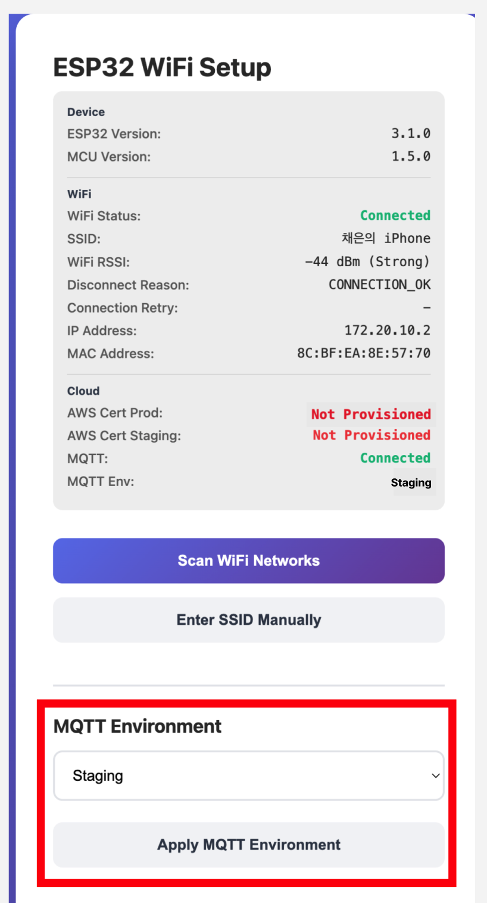

> [!NOTE]
> 이 시점에 `AWS Cert Staging` 이 **`Not Provisioned`** 인 것은 정상입니다.
> 아직 모니터링 페이지에 등록하지 않았기 때문이며, 3단계를 마치면 자동으로 `Provisioned` 가 됩니다.

이 화면의 **`MAC Address`** 값을 다음 단계에서 그대로 사용합니다. 메모해 두세요.

---

## 3단계 모니터링 등록

### 3.1 로그인

<https://staging.smarthearingloop.com> 에 접속해 `admin` / `admin1234` 로 로그인합니다.

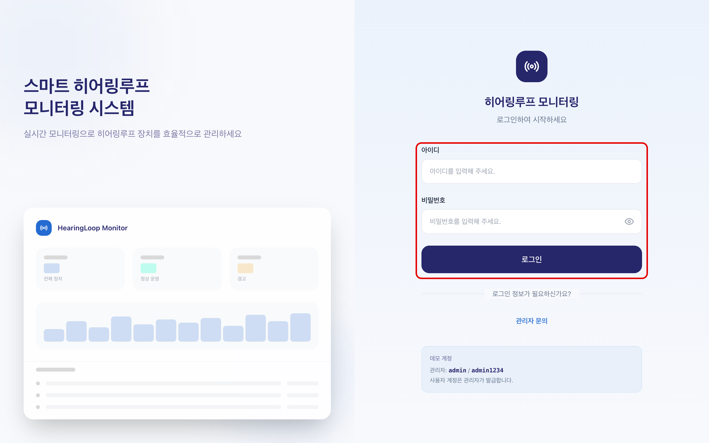

### 3.2 히어링루프 등록

1. 상단 메뉴에서 **`히어링루프 관리`** 로 이동합니다.
2. 오른쪽 위 **`+ 히어링루프 등록`** 을 누릅니다.

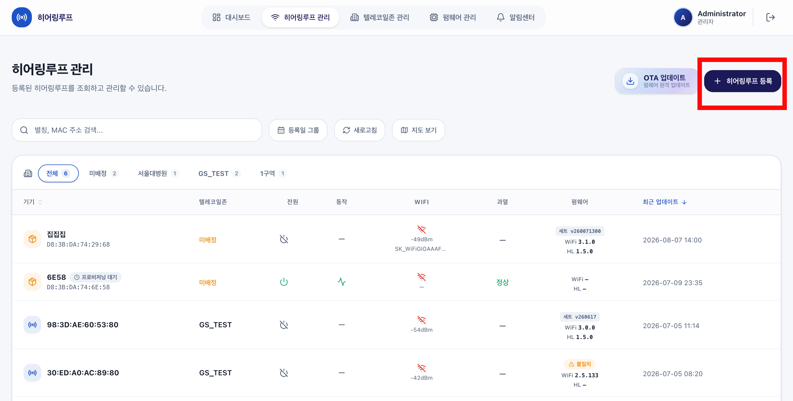

3. 2단계에서 확인한 **MAC 주소**를 입력합니다. (텔레코일존·별칭은 선택이며 비워도 됩니다)
4. **`등록`** 을 누릅니다.

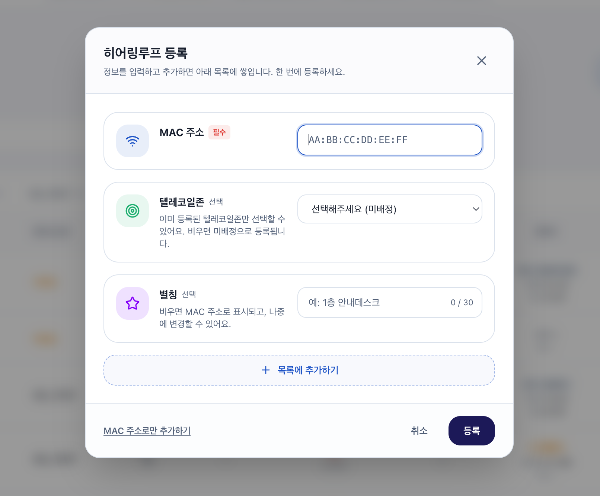

> [!TIP]
> 여러 대를 한 번에 등록하려면 `목록에 추가하기` 로 쌓은 뒤 마지막에 `등록` 을 누르세요.

### 3.3 프로비저닝 대기 → 자동 해제

등록하면 목록에 **`프로비저닝 대기`** 표시와 함께 나타납니다.

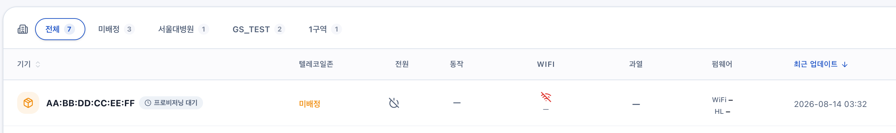

**이것은 사람이 조작하는 것이 아닙니다.** 기기가 서버에 접속해 인증을 마치면 서버가 자동으로 처리하며,
완료되면 표시가 사라집니다.

> [!IMPORTANT]
> 등록을 **먼저** 해야 기기가 접속할 수 있습니다.
> 등록되지 않은 MAC은 서버가 접속을 거부하므로 순서를 지켜주세요.

### 3.4 정상 연결 확인

`프로비저닝 대기` 가 사라지고 네 항목이 모두 초록색이면 성공입니다.

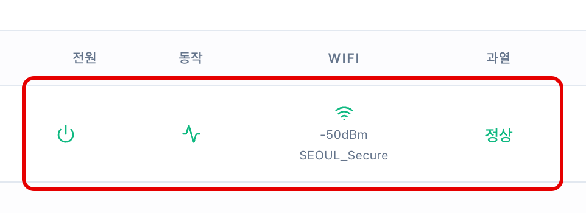

| 항목 | 정상 표시 |
| --- | --- |
| 전원 | `ON` |
| 동작 | `정상 작동` |
| WIFI | 초록색 신호 아이콘 + 세기 |
| 과열 | `정상` |

설정 페이지로 돌아가면 `AWS Cert Staging` 이 **`Provisioned`** 로 바뀐 것도 확인할 수 있습니다.

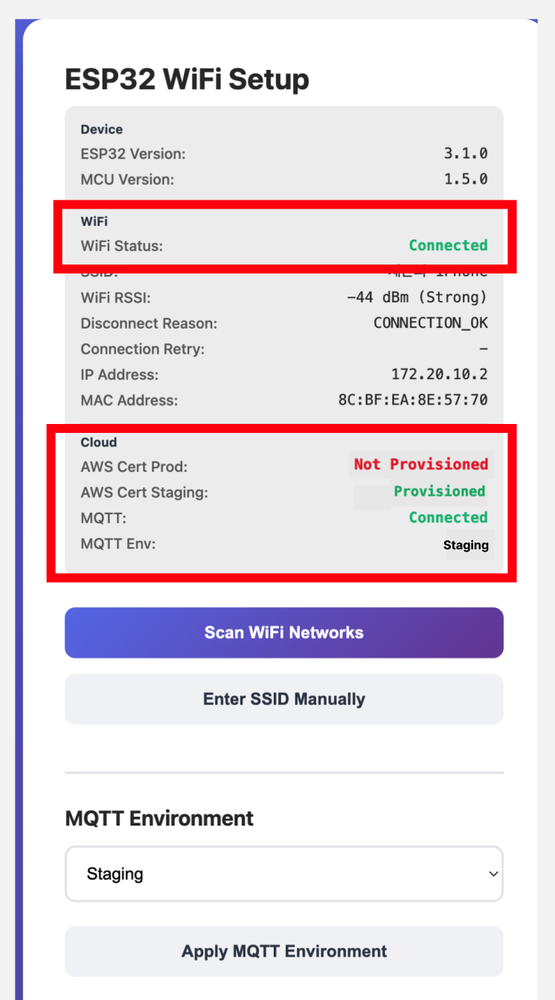

### 3.5 상세 정보 보기

목록에서 기기를 클릭하면 전원·동작·Wi-Fi 신호(연결된 SSID 포함)·과열 경보·펌웨어 버전·등록일을
한 화면에서 볼 수 있습니다.

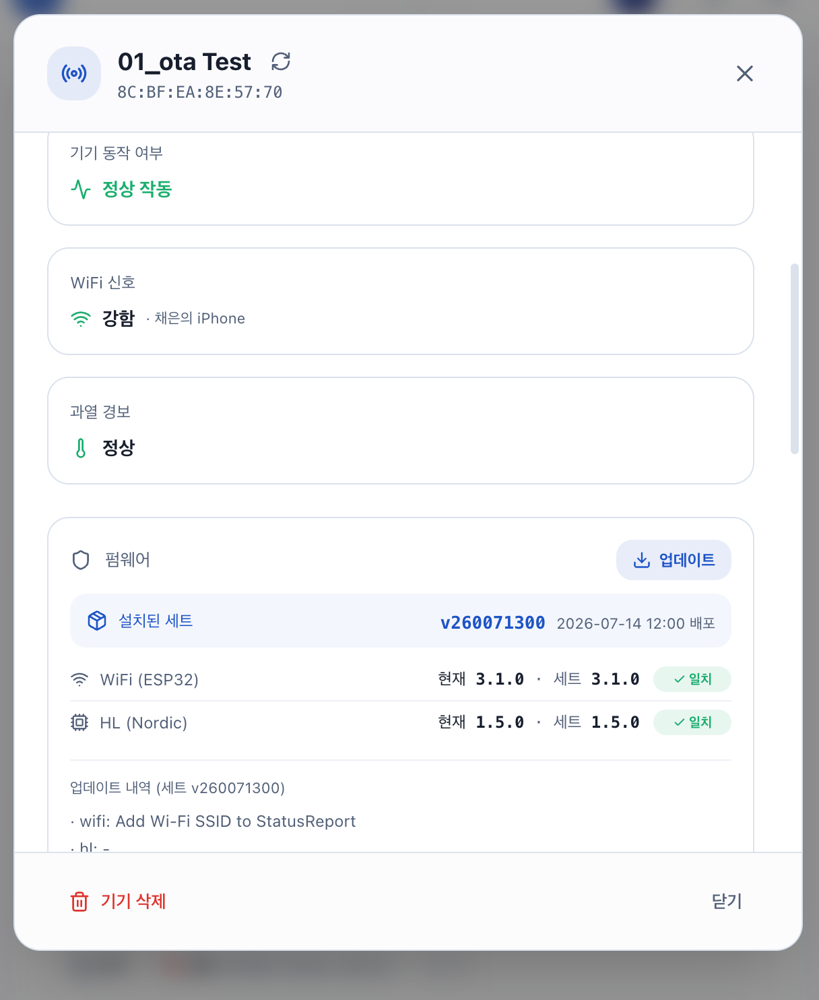

---

## 4단계 원격 펌웨어 업데이트

3단계까지 마치면 기기에 직접 접속하지 않고 웹에서 원격으로 펌웨어를 올릴 수 있습니다.
**시험에 필수는 아닙니다.**

1. 기기 상세 화면에서 **`업데이트`** 를 누릅니다.

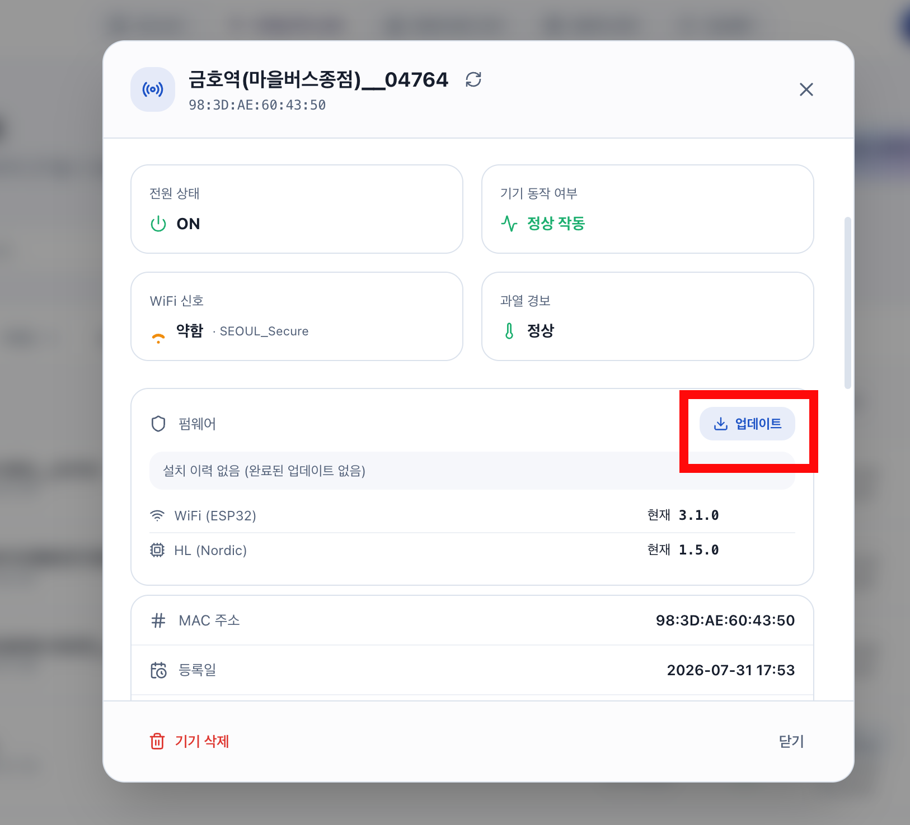

2. 보낼 펌웨어(`v260071300`)를 선택하고 **`업데이트 전송`** 을 누릅니다.

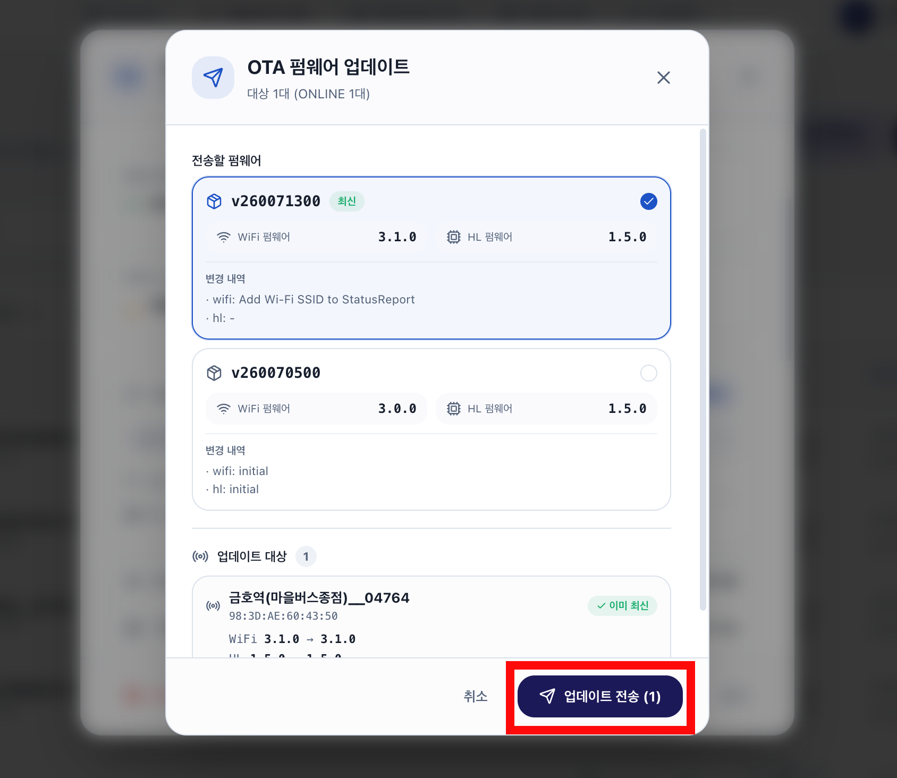

3. WiFi(ESP32)·HL(Nordic) 진행률이 각각 100%가 되고 `완료` 로 바뀌면 성공입니다.

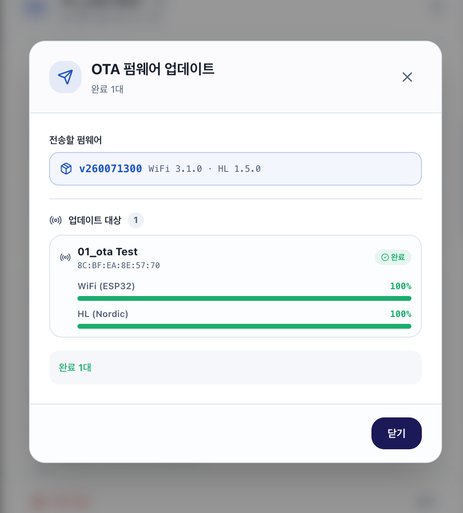

### 알아두실 점

**온라인 상태인 기기만 전송할 수 있습니다.** 오프라인 기기는 `작동 중지` 로 표시되고 선택되지 않습니다.

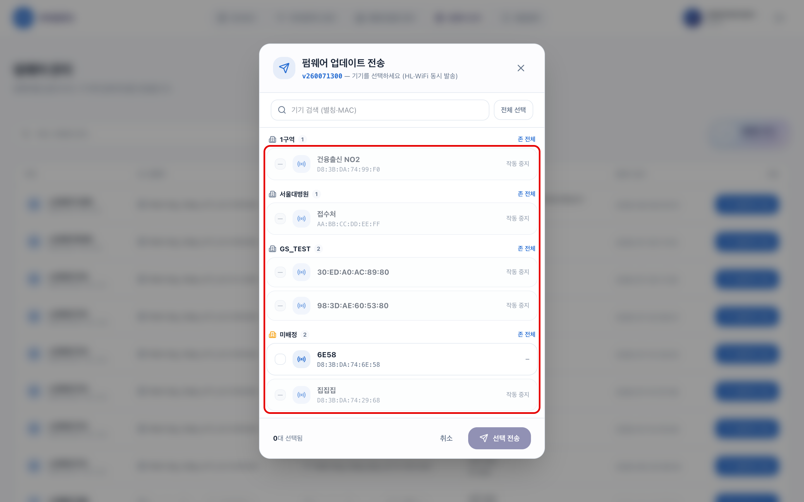

- **이미 같은 버전이면** 기기에 아무것도 전송되지 않고 기록만 남습니다. 기기는 재부팅하지 않으며 `이미 최신` 으로 표시됩니다.
- 실제 업데이트는 **몇 분** 걸리며 기기가 재부팅됩니다. **3분간 응답이 없으면 실패**로 처리됩니다.
- `설치된 세트` 옆 날짜는 **펌웨어가 배포된 날짜**이며, 이 기기에 설치된 시각이 아닙니다.

### 결과 확인

`기기 이력 > 업데이트 이력` 탭에서 성공은 초록 `완료`, 실패는 빨간 `실패` 로 남습니다.
행을 클릭하면 단계별 상세 로그를 볼 수 있습니다.

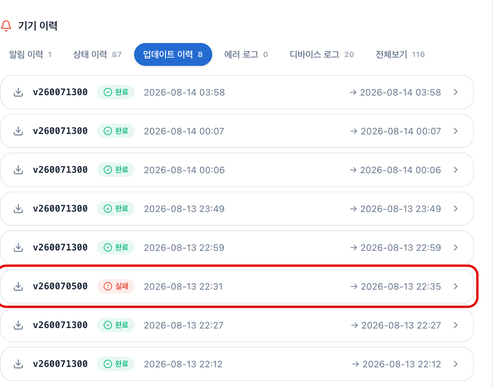

*실패 행은 시작과 종료 시각이 다릅니다(22:31 → 22:35). 3분 넘게 응답이 없어 실패 처리된 사례입니다.*

---

## 자주 묻는 질문

<details>
<summary><b>등록했는데 목록에 안 보입니다</b></summary>

<br>

ESP32 펌웨어가 3.1.0 미만이면 나타나지 않습니다. 설정 페이지에서 버전을 확인하세요.
버전이 맞다면 다음을 확인합니다.

- `MQTT Env` 가 `Staging` 인지
- 접속한 페이지가 `staging.smarthearingloop.com` 인지

</details>

<details>
<summary><b>IP 주소를 넣을 칸이 없습니다</b></summary>

<br>

정상입니다. 기기는 MAC 주소로만 식별하며 IP는 사용하지 않습니다.
설치 장소나 공유기가 바뀌어도 재등록할 필요가 없습니다.

</details>

<details>
<summary><b>설정 페이지에 <code>MQTT Environment</code> 항목이 없습니다</b></summary>

<br>

아직 3.1.0 미만입니다. [1단계](#1단계-펌웨어-업데이트)를 먼저 진행하세요.

</details>

<details>
<summary><b><code>프로비저닝 대기</code> 가 사라지지 않습니다</b></summary>

<br>

기기 전원이 켜져 있고 공유기에 연결돼 있는지 확인하세요.
설정 페이지에서 `MQTT: Connected` 인지도 함께 확인합니다.

</details>

<details>
<summary><b>전원이 <code>ON</code> 인데 동작이 표시되지 않습니다</b></summary>

<br>

전원·동작 표시는 모두 **서버와의 연결 상태**를 기준으로 합니다.
연결이 끊기면 실제 전원이 켜져 있어도 꺼진 것으로 표시됩니다.

</details>

<!-- <details>
<summary><b>온도는 안 보이나요</b></summary>

<br>

이 기기에는 온도 센서가 없습니다. 대신 **과열 경보**(정상 / 과열)로 표시되며,
과열 시 하드웨어가 자동으로 출력을 낮춰 보호합니다.

</details> -->

---

## 문의


| **이름** | **이채은** |
| --- | --- |
| **소속** | **WhatWeCare** |
| **연락처** | **olchaeun@berhmkorea.com** |


